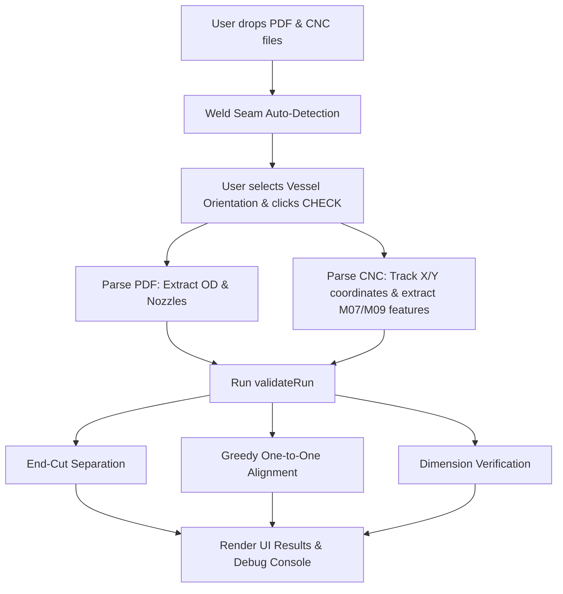

# CARV
Cut Accuracy Review and Verification - CNC program cecker for Rotary Tube Pro pipe vessel fabrication.

### Overview & Objective

**CARV** (**C**ut **A**ccuracy **R**eview and **V**erification) is a high-accuracy, client-side G-code/CNC analyzer designed for **Rotary Tube Pro (RTP)** pipe vessel fabrication (specifically for *RVS Corp*). 

In pipe vessel fabrication, operators must cut holes (nozzles) in large steel pipes using a CNC rotary pipe cutter. The engineering drawings specify nozzle locations as angular degrees (e.g., $45^\circ$, $270^\circ$). However, when laying out the pipe in the rotary cutting machine, the physical longitudinal weld seam of the pipe is rotated to a specific orientation angle (the **Seam Angle**). 

Because the weld seam serves as the physical alignment reference, the CNC machine angles must be offset from the print angles to ensure the nozzles are cut in the correct places relative to the weld seam. Setting these formulas or seam angles incorrectly leads to ruined steel pipes. 

CARV automates the process of double-checking the machine program:
1. **Reads the Certified Drawing PDF** to extract the pipe Outer Diameter (OD), the expected seam angle, and the list of planned nozzles with their print angles.
2. **Parses the CNC G-code program (`.cnc`/`.txt`)** to extract the actual physical cut features, sizes, and coordinates generated by the CAM software.
3. **Applies coordinate math** based on the vessel orientation (Horizontal vs. Vertical) and the weld seam offset.
4. **Performs an intelligent, greedy matching alignment** between the drawing's nozzles and the G-code's cuts to verify that every cut is in the correct location within a strict tolerance ($\pm 5^\circ$), flagging any mismatches before the physical cutting begins.

---

### Core Coordinate Math

The critical math transformations are defined in [`src/domain/angles.js`](file:///c:/E%20Drive/04_Automation/Apps/CARV/Program/CARV/src/domain/angles.js):

*   **Horizontal Vessel Orientation:**
    $$\text{Expected RTP Angle} = (360 - \theta_{\text{seam}} + \theta_{\text{print}}) \pmod{360}$$
*   **Vertical Vessel Orientation:**
    $$\text{Expected RTP Angle} = (\theta_{\text{seam}} - \theta_{\text{print}} + 360) \pmod{360}$$
*   **Angular Distance:**
    To compare cut angles across the wrap-around boundary ($0^\circ = 360^\circ$), the system calculates the shortest distance along the circle:
    $$\Delta\theta = \text{abs}(a - b) \pmod{360}$$
    $$\text{Shortest Distance} = \Delta\theta > 180^\circ ? (360 - \Delta\theta) : \Delta\theta$$

---

### Architecture & File Structure

The project is structured according to **clean architecture principles**: UI code is separated from pure business logic, enabling easy updates and high testability.

*   [`index.html`](file:///c:/E%20Drive/04_Automation/Apps/CARV/Program/CARV/index.html): Clean, semantic page template with a robust Content Security Policy (CSP).
*   [`styles.css`](file:///c:/E%20Drive/04_Automation/Apps/CARV/Program/CARV/styles.css): Custom CSS styles implementing a sleek, dark-themed industrial aesthetic.
*   [`src/main.js`](file:///c:/E%20Drive/04_Automation/Apps/CARV/Program/CARV/src/main.js): Orchestrator (bootstrap). Wires up UI event handlers, connects drag-and-drop zones, manages asynchronous loading states, and runs the parsing and validation workflow.
*   [`src/state.js`](file:///c:/E%20Drive/04_Automation/Apps/CARV/Program/CARV/src/state.js): Central source of truth for the application state (loaded files, orientation state, active autodetect promises, and output validation results).
*   **`src/config/`**:
    *   [`nozzles.js`](file:///c:/E%20Drive/04_Automation/Apps/CARV/Program/CARV/src/config/nozzles.js): Stores tolerancing rules (e.g., $\pm5^\circ$ match tolerance, $\pm15^\circ$ warning limit, $\pm0.1\text{ inch}$ OD limit) and fallback dimensions.
    *   [`pdf.js`](file:///c:/E%20Drive/04_Automation/Apps/CARV/Program/CARV/src/config/pdf.js): Spatial clustering margins and string distance settings.
*   **`src/parsers/`** (Pure functions, no DOM dependencies):
    *   [`pdf.js`](file:///c:/E%20Drive/04_Automation/Apps/CARV/Program/CARV/src/parsers/pdf.js): Coordinates text extraction and schedules spatial recognition of nozzles and diameters using PDF.js.
    *   [`seam.js`](file:///c:/E%20Drive/04_Automation/Apps/CARV/Program/CARV/src/parsers/seam.js): Contains algorithms for spatial and regex-based weld seam angle detection from PDF text.
    *   [`cnc.js`](file:///c:/E%20Drive/04_Automation/Apps/CARV/Program/CARV/src/parsers/cnc.js): A stateful G-code parser that traces coordinates, handles coordinate modes (G90 absolute vs. G91 relative), and extracts feature start/end cycles.
*   **`src/domain/`** (Pure mathematical logic, no DOM dependencies):
    *   [`angles.js`](file:///c:/E%20Drive/04_Automation/Apps/CARV/Program/CARV/src/domain/angles.js): Calculates coordinate translations and angular circle deltas.
    *   [`validate.js`](file:///c:/E%20Drive/04_Automation/Apps/CARV/Program/CARV/src/domain/validate.js): Matches physical CNC cuts against drawing specifications, identifies end cuts, and scores matches.
*   **`src/ui/`** (DOM rendering only):
    *   [`dropzone.js`](file:///c:/E%20Drive/04_Automation/Apps/CARV/Program/CARV/src/ui/dropzone.js): Visual drag-and-drop file upload wrappers.
    *   [`results.js`](file:///c:/E%20Drive/04_Automation/Apps/CARV/Program/CARV/src/ui/results.js): Builds results lists, warning bars, end-cut specifications, and unmatched feature listings.
    *   [`debug.js`](file:///c:/E%20Drive/04_Automation/Apps/CARV/Program/CARV/src/ui/debug.js): Renders G-code parser traces and G-code block summaries.
    *   [`toast.js`](file:///c:/E%20Drive/04_Automation/Apps/CARV/Program/CARV/src/ui/toast.js): Toast notifications.

---

### Step-by-Step Execution Workflow

#### Step 1: File Ingestion & Caching
When a file is dropped onto the PDF dropzone, an asynchronous worker registers it. CARV attaches a temporary property `__carvCache` directly to the `File` object once it is parsed. If the user runs multiple verification passes, the file is read from memory instantly rather than running expensive PDF decoding again.

#### Step 2: Weld Seam Auto-detection
Upon dropping the PDF, [`autoDetectSeam()`](file:///c:/E%20Drive/04_Automation/Apps/CARV/Program/CARV/src/parsers/pdf.js#L78) runs automatically in the background to pre-populate the seam angle field:
1. **Spatial Proximity:** It searches for the text label `"SEAM"`. It then finds all parsed numbers representing angles (e.g. $45^\circ$, $180^\circ$) on the same page and computes the Euclidean distance ($dx$, $dy$) between their bounding boxes using `Math.hypot()`. The physically closest angle within 300 PDF units wins.
2. **Text Regex Fallback:** If spatial association fails, it runs a regex scan on the text stream to find patterns like `(\d{1,3})\s*°\s*SEAM` or `SEAM\s*(\d{1,3})`.
3. **Proximity Text Fallback:** If that also fails, it checks a $\pm 40$ character window around the word `"SEAM"` in the text stream and picks the numeric value closest in character offset.

#### Step 3: CNC Program Parsing
When G-code is loaded, the stateful CNC parser in [`cnc.js`](file:///c:/E%20Drive/04_Automation/Apps/CARV/Program/CARV/src/parsers/cnc.js) processes it line-by-line:
1. **Metadata Header:** It searches for the Rotary Tube Pro header comment, e.g., `(CutPro Wizard - Load Material : A106-B; 240.0" x 62.83" ; 0.375" )` to determine the pipe circumference ($62.83\text{ inches}$), thickness ($0.375\text{ inches}$), and length.
2. **Coordinate State Tracking:** G-code represents rotary pipe positioning using the `Y` linear axis (inches of travel around the circumference of the belt) and the linear length using the `X` axis. It can also output a `C` axis command representing degrees (e.g. `C270`), which is converted to linear inches: $Y = (C / 360) \times \text{circumference}$.
3. **Abs/Incremental Mode:** G90/G91 states are tracked dynamically to correctly sum coordinate offsets.
4. **Feature Isolation:**
    *   **M07** starts a **CUT** feature (a hole); **M08** terminates it.
    *   **M09** starts a **SCRIBE** feature (a laser engraving/ink line); **M10** terminates it.
    The coordinate $\{x, y\}$ at the start of the feature represents the nozzle's center. The linear belt coordinate $y$ is converted into degrees: $\text{deg} = ((y / \text{circumference}) \times 360) \pmod{360}$.

#### Step 4: Spatial PDF Nozzle Extraction
PDF text streams can be disorganized, representing tabular schedules out of reading order. [`extractNozzles()`](file:///c:/E%20Drive/04_Automation/Apps/CARV/Program/CARV/src/parsers/pdf.js#L131) solves this spatially:
1. **Y-Clustering:** It groups text elements into rows where $y$-coordinates differ by $\le 6$ units (the height of a text row).
2. **Token Extraction:** Within each row, it extracts nozzle identifiers (matching `N1`, `N-2`, etc.) and degree coordinates (matching `^\d{1,3}°$`).
3. **Horizontal Proximity Pairing:** For every nozzle found in a row, it pairs it with the horizontally closest degree text box in that same row.

#### Step 5: The Validation Engine (Matching and Alignment)
Once both files are parsed, [`validateRun()`](file:///c:/E%20Drive/04_Automation/Apps/CARV/Program/CARV/src/domain/validate.js#L70) aligns them:
1. **Pipe Size Check:** Compares the print OD parsed from the PDF against the CNC-calculated OD ($\text{circumference} / \pi$). A difference $> 0.1\text{ inch}$ immediately flags a critical error.
2. **End-Cut Separation:** When G-code files contain pipe trim cuts (facing the ends of the pipe) in addition to nozzle cuts, there will be more cut operations than nozzles. CARV identifies the minimum and maximum $x$-coordinate cuts and marks them as non-nozzle "End Cuts," removing them from the matching process to prevent false positives.
3. **Greedy One-to-One Alignment:**
    *   It computes the Expected RTP Machine Angle for every nozzle.
    *   It creates a list of all possible combinations between expected nozzle angles and actual G-code cut angles, sorted by angular distance.
    *   It binds the closest pairs one by one. Once a cut is matched, it is locked so that a single G-code cut cannot be matched to multiple nozzles (which would mask a missing cut).
    *   *Special Exception:* If two distinct nozzles legitimately share the exact same print angle on the drawing, they are permitted to share a single G-code cut location without triggering an error.
4. **Scoring:** Matches within $\le 5^\circ$ receive a **PASS** status. Matches between $5^\circ$ and $15^\circ$ receive a **WARN** status. Larger errors or unmatched features trigger a **FAIL/REVIEW** status.

#### Step 6: Visual Reporting & Trace Log
The results are mapped directly to the UI cards and lists using safe DOM operations (preventing injection vulnerabilities). A **Parser Debug Panel** displays the raw G-code trace log, absolute calculations, and feature counts, allowing the operator to verify exactly how CARV processed the G-code.

---

### Key Technical Highlights

1. **Robust Client-Side Security:** CARV relies entirely on client-side parsing without server-side compute. The Content Security Policy (CSP) restricts script loading to local code and the pinned CDN for `pdf.js`, eliminating exposure to external scripts.
2. **Defensive G-Code Tokenization:** The G-code parser pre-clears both `;` and `(...)` comments on each line and tokenizes the code on whitespace, making it resilient to custom CAM formatting variations.
3. **No-Dangling Feature Check:** If an `M07` or `M09` block starts but does not have a corresponding `M08` or `M10` end block before the end of the file, CARV surfaces an explicit parser warning in the UI rather than silently dropping the feature.
